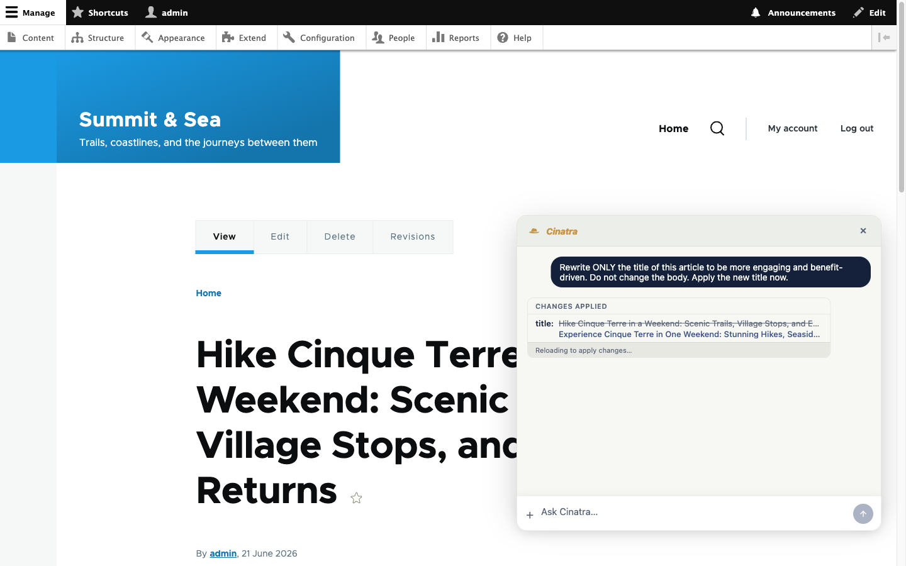
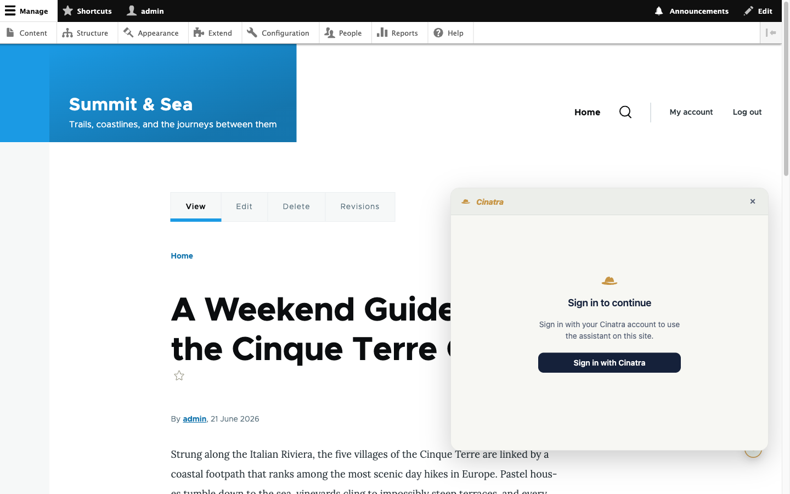
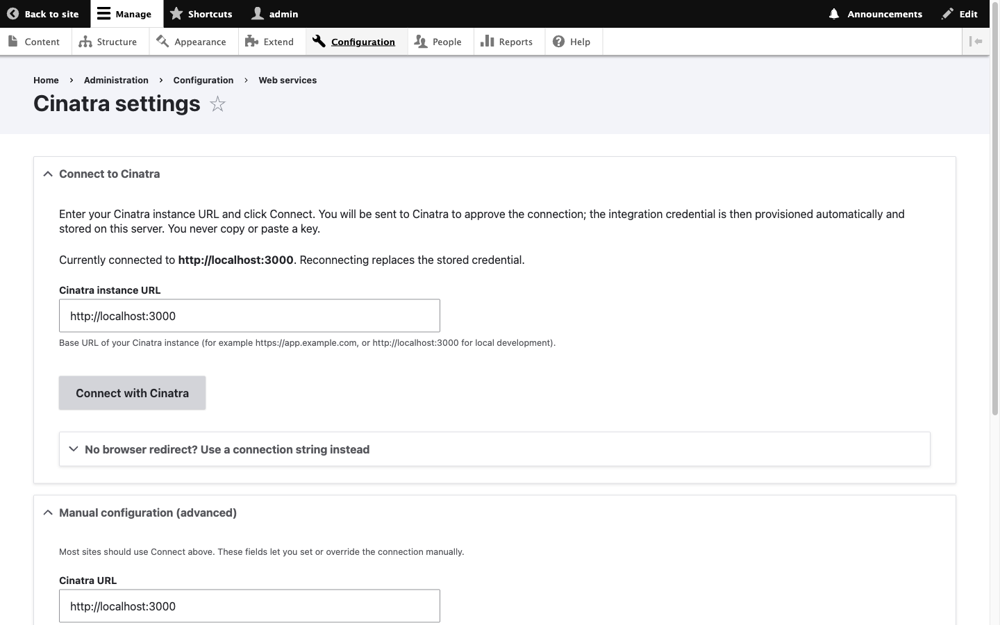

<!--
  Drupal.org project-page source of truth for the Cinatra module.

  This file is staged content for the drupal.org project node + Project Browser.
  The drupal.org project is PARKED (not yet created); when it is created, copy
  the sections below into the matching drupal.org fields and promote the logo
  (see "Logo" + ../.gitattributes note). This whole .drupalorg/ directory is
  export-ignored from the release tarball, so none of it ships to end users.

  Brand source: the Cinatra design system (tokens/brand.json, assets/logo/variants.json).
  Voice/marking rules: write plain "Cinatra" (no trademark glyphs — this is an
  open source project); write "open source" unhyphenated.
-->

# Cinatra — Drupal.org project page

## Project short name (machine name)

`cinatra` — so the project URL is `https://www.drupal.org/project/cinatra` and
`composer require drupal/cinatra` will resolve once the drupal.org project and a
release exist. (Matches `cinatra.info.yml` and `composer.json` `drupal/cinatra`.)

## Title

Cinatra

## Short description / "Edit Summary" (Project Browser card, max 200 chars)

> Embed the Cinatra AI assistant on Drupal node pages so editors can draft, expand, and revise content in a chat panel right next to what they are editing — without leaving the page.

(176 characters — within Project Browser's 200-character limit.)

## Categories (Project Browser — pick up to 3)

1. **Content** (content authoring / editorial workflow)
2. **AI** (AI-assisted editing) — or "Content Display / Editor" if an AI
   category is unavailable at submission time
3. **Third-party Integration** (connects Drupal to a Cinatra instance)

> Confirm the exact category names available in the drupal.org project form at
> creation time; these are the intended buckets.

## Maintenance status

Actively maintained

## Development status

Under active development

## Full project-page description (body)

<!-- Paste as the project node body. drupal.org project bodies are filtered
     HTML, NOT Markdown: at paste time, convert the headings/bold/`code`/images
     below to <h3>/<strong>/<code>/ (or the body field's WYSIWYG
     equivalents). Keep links absolute. -->

### Cinatra for Drupal

This module puts the Cinatra AI assistant right on your Drupal pages, so content
editors can draft, expand, and revise content in a chat panel next to what they
are editing — without leaving the page they are working on.

The assistant talks to **your** Cinatra instance — the one whose address you
enter in the settings. You choose and control which instance your content goes
to; it is not tied to a fixed outside service.

### What does the assistant help me do?

It's an AI assistant built right into the editor. It helps you draft, rewrite,
shorten, retitle, and improve content and answer questions while you work.
Because it runs through your own Cinatra instance, it isn't a generic writing
tool — it works through a Cinatra agent on your instance, so it can draw on the
tools, data, and knowledge you've connected there and bring that capability
straight into your CMS.

It knows the page you are on, so its suggestions fit the content you are
actually editing. You review what it suggests and decide what to keep; when your
instance supports it, an accepted change is dropped straight back into the page.

### Do I need a Cinatra account?

You need access to a running Cinatra instance. Cinatra is an open source AI
platform that you or your organisation host and connect the assistant to — learn
more and get the source at <https://www.cinatra.ai>. Once your instance is
running, open the Cinatra settings, enter the instance's web address, and
connect.

### What it does for editors

- Adds an AI assistant panel on node pages, node edit forms, and the front page,
  so help is one click away while you write.
- Knows the page you are on, so its suggestions fit the content you are actually
  editing.
- Drafts and rewrites text on request. The editor always reviews what the
  assistant suggests and decides what to keep; when your instance supports it,
  suggested changes can be dropped straight into the form.
- Shows the assistant **only** to the people you choose, using a dedicated
  permission (see below) — not to every logged-in user.

### Getting started

1. Install the module: `composer require drupal/cinatra` (or place it under
   `modules/custom/cinatra/`).
2. Enable it: `drush en cinatra`.
3. Go to **Configuration → Web services → Cinatra**
   (`/admin/config/services/cinatra`), enter your Cinatra instance address, and
   click **Connect with Cinatra**. Approve the connection on the screen that
   appears, and you are set up. (No redirect in your setup? Paste the one-line
   connection code instead, or use the **Manual configuration** section.)
4. On **People → Permissions**, give the **"Use the Cinatra AI assistant"**
   permission to the content editors who should see the assistant.

### Requirements

- Drupal core `^10.3 || ^11`.
- A Cinatra instance you can reach, with the assistant turned on. With an older
  Cinatra instance the panel shows a short "update Cinatra" notice instead of
  the assistant.

### Who can use it

The assistant appears only for users who have the **"Use the Cinatra AI
assistant"** permission. The assistant can read the current page and suggest
content changes, so give this permission to people you trust to edit content.

### Your content

When an editor chats with the assistant, the messages they type and the page
they are on are sent to the Cinatra instance you set up — and nowhere else. That
instance's own privacy terms cover this data; see <https://www.cinatra.ai>.

### Screenshots

**The assistant in action.** The Cinatra assistant panel open on a node page,
rewriting the article's title on request and applying the change back to the
content.



**Sign in with your Cinatra account.** The assistant asks each person to sign in
with their own Cinatra account, so it only does what that user is already allowed
to do on the site.



**Connect to your Cinatra instance.** The **Configuration → Web services →
Cinatra** settings page: enter your instance's web address and click **Connect
with Cinatra** — the integration credential is provisioned automatically, so you
never copy or paste a key.



### What's new since 0.1.0

- **One-click "Connect with Cinatra".** Connecting is now a single button: enter
  your instance address, approve the connection, and the integration credential
  is provisioned and stored on your server automatically — you never copy or
  paste a key. (A connection-string and manual-configuration path is still there
  for setups without a browser redirect.)
- **Suggested edits drop straight into the page.** When your instance supports
  it, a change the assistant proposes can be applied back to the content you are
  editing, not just shown as text to copy by hand.
- **A clear compatibility notice on older instances.** If the connected instance
  is too old to run the assistant, the panel now shows a short, plain message
  instead of failing silently — so you always know what to do next.
- **More reliable manual setup.** The connection fields stay visible so you can
  always see and adjust them, and the behind-the-scenes connection to your
  instance was made more dependable.
- **Translatable interface and built-in help.** The module's Drupal-side
  messages — settings, fallback, permission, and help text — are now
  translatable, with a dedicated **Cinatra** entry in the admin menu plus
  in-page help.

### License

GPL-2.0-or-later. The bundled assistant is the Cinatra app frontend under
Apache-2.0, which is compatible with the GPL.

## Resources / links (project-page "Resources" links)

- Cinatra website: <https://www.cinatra.ai>
- Source repository (canonical): <https://github.com/cinatra-ai/drupal-module>
- Issue queue: use the drupal.org project issue queue once the project is created
  (mirror/triage policy with the GitHub repo to be set at creation time).
- License (GPL-2.0-or-later): see `LICENSE` in the repository.

## Logo

The Project Browser project logo is generated from the Cinatra brand and stored
in `.drupalorg/images/`:

- `.drupalorg/images/logo.png` — **512×512 PNG**, no animation, square corners,
  ~2 KB (well under the ~10 KB Project Browser guidance; compressed with
  pngquant). The sanctioned brand **primary (mustard)** colourway: the mustard
  fedora mark (`#c79545`) on a white/paper ground (`#ffffff`).
- `.drupalorg/images/logo_svg.txt` — the vector master for crisp rendering.

Regenerate with `node .drupalorg/generate-logo.mjs` (see that script's header).

**Promotion at project-creation time** (Project Browser requires the files at the
repo *root* on the default branch):

```
cp .drupalorg/images/logo.png      ./logo.png
cp .drupalorg/images/logo_svg.txt  ./logo_svg.txt
git add logo.png logo_svg.txt && git commit -m "chore: add Project Browser logo"
```

Do not also add a logo to the project page "Images" field — Project Browser uses
the repo-root `logo.png`, and a duplicate in the Images field is deprecated.

> Why mustard-on-white and not the navy ground: the Cinatra brand rule is
> "mustard on paper or surface; never mustard on the navy ground"
> (brand asset metadata, `assets/logo/variants.json`, `meta.rule`). The mustard
> fedora reads correctly on a white/paper ground, so that is the colourway used
> here. The PNG is rendered with **square corners and no border** — Project Browser
> applies its own mask and renders the tile on its own surface, so we bake in
> neither a corner radius nor a chip. Brand source: the Cinatra design system's
> `assets/logo/variants.json` (`colorways.mustard`) and `tokens/brand.json`.

## Screenshots — files + alt text

The screenshots embedded in the body above are real captures against a running
Drupal + Cinatra stack, stored under `.drupalorg/images/`. At project-creation
time, attach them to the project page's Images field (or keep them inline in the
body as above). Like the logo, they are export-ignored and never ship in the
release tarball.

1. **`screenshot-in-action.png` — the assistant in action.**
   The Cinatra assistant panel open on a node page, rewriting the article's
   title on request and applying the change back to the content.
   - *Alt text:* "Cinatra AI assistant panel open beside a Drupal article,
     rewriting the title and updating the content."

2. **`screenshot-login.png` — sign in with your Cinatra account.**
   The Cinatra sign-in window the assistant shows so each person works with their
   own Cinatra account and their own permissions.
   - *Alt text:* "Cinatra sign-in window in Drupal with a Sign in with Cinatra
     button."

3. **`screenshot-connect.png` — connect to your Cinatra instance.**
   The **Configuration → Web services → Cinatra** admin settings page, showing
   the instance-address field and the **Connect with Cinatra** button.
   - *Alt text:* "Cinatra settings page in Drupal showing the instance URL field
     and the Connect with Cinatra button."

**Screenshot conventions:** PNG; hide real instance addresses; keep each image's
longest edge reasonable so the page stays light. Store final screenshots under
`.drupalorg/images/`.
